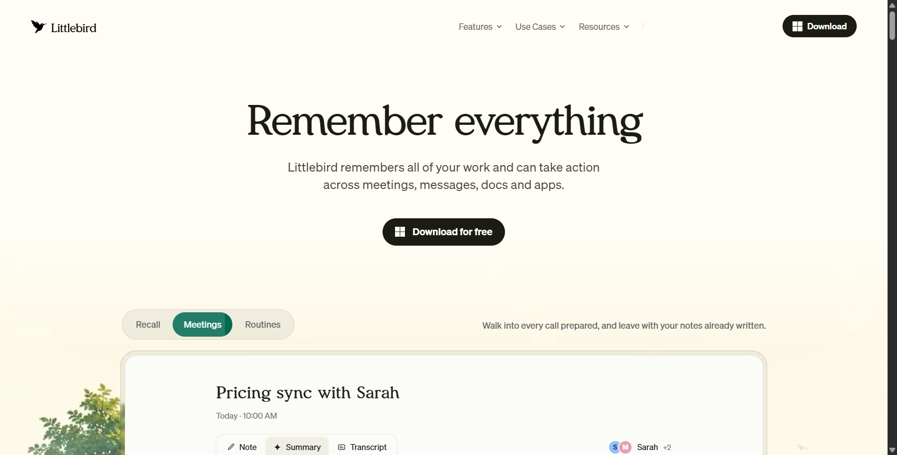
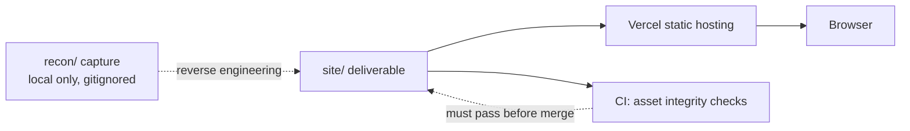

# Littlebird.ai Static Rebuild

> A pixel-oriented static rebuild of the [littlebird.ai](https://littlebird.ai) home page, remade as plain HTML/CSS/JS from captured assets and reverse-engineered interactions.

[](https://github.com/AkashNaickar/crdb-sample-frontend/actions/workflows/ci.yml)
[](LICENSE)
[](https://crdb-sample-frontend.vercel.app)

**[Live demo →](https://crdb-sample-frontend.vercel.app)**



> Note: the repository is named `crdb-sample-frontend` for historical reasons. Its
> contents are a static rebuild of the Littlebird.ai home page.

## Features

- Static rebuild of the Littlebird.ai home page, deployed as a single static site.
- Five self-contained iframe demos (hero tabs, apps, meetings, routines, drafting).
- Scroll-triggered animations driven by `IntersectionObserver` (five observers in `js/main.js`).
- OS-aware download CTA: the button label and icon switch between Windows, macOS, iOS, and Android based on `navigator.userAgent` / `navigator.platform`.
- Responsive layout with breakpoints at 479px, 767px, 991px, and 1440px.
- Honors `prefers-reduced-motion` by skipping scroll animations.
- No frameworks and no build step: one stylesheet, one script file, self-hosted fonts.

## Tech stack

| Layer | Technology |
|-------|------------|
| Markup | Hand-authored HTML5 (originating from the captured Webflow markup) |
| Styling | Single hand-maintained stylesheet, `site/css/style.css` |
| Behaviour | Vanilla JavaScript, `site/js/main.js` (~270 lines) |
| Fonts | Self-hosted Meraki and Söhne (`woff2` / `otf`) |
| Embeds | Five standalone HTML/CSS/JS demo pages under `site/embeds/` |
| Hosting | Vercel (static, no server runtime) |
| CI | GitHub Actions running Node's built-in test runner |

## Architecture



The `site/` directory is the entire shipped artifact. `recon/` holds the local
capture used to build it and is intentionally not tracked by git, so a clone only
contains what is deployed.

## Project structure

```
crdb-sample-frontend/
├── site/                    # the deployed deliverable
│   ├── index.html           # the rebuilt home page
│   ├── 404.html             # explains routes that were not captured
│   ├── css/style.css        # all styling and media queries
│   ├── js/main.js           # animations, nav, CTA detection
│   ├── fonts/               # self-hosted Meraki + Söhne
│   ├── images/              # captured and remapped assets
│   └── embeds/              # five self-contained iframe demos
├── scripts/
│   ├── check-site.test.mjs  # asset-reference integrity tests
│   └── serve.mjs            # dependency-free local preview server
├── docs/screenshot.png      # hero screenshot used above
├── .github/workflows/       # ci.yml, gitleaks.yml
└── package.json
```

`recon/` (the raw capture) is present on the original author's machine but
gitignored; see [Third-party assets and attribution](#third-party-assets-and-attribution).

## Quick start

> These commands were run against a clean clone on Windows with Node 20+.
> No dependencies are installed; Node's standard library is all that is used.

```bash
git clone https://github.com/AkashNaickar/crdb-sample-frontend.git
cd crdb-sample-frontend

npm test        # verify every local asset reference resolves
npm run serve   # preview at http://localhost:8123
```

Then open <http://localhost:8123>. To preview with any other static server instead:

```bash
cd site && python -m http.server 8123
```

## Configuration

None. This is a static site with no runtime environment variables, API keys, or
secrets. Nothing needs to be configured to run or deploy it.

## Testing

```bash
npm test
```

The suite (`scripts/check-site.test.mjs`) runs five checks against `site/`:

1. `index.html` exists and has a real title.
2. Every local asset reference in HTML and CSS resolves to a committed file.
3. The deliverable does not depend on the gitignored `recon/` scrape.
4. All five captured embed pages are present and non-empty.
5. The core assets (stylesheet, script, logo, hero video) are committed.

## Deployment

Deployed on Vercel as a static project:

- Production: <https://crdb-sample-frontend.vercel.app>
- Project root directory: `site`
- No build step; Vercel serves `site/` directly.

The site is published from the `site/` directory with the Vercel CLI:

```bash
vercel deploy site --prod
```

`site/.vercelignore` keeps local `.env*` files and Vercel metadata out of the
upload, so only the static deliverable is served.

## Roadmap

- [ ] Capture additional routes (for example `/pricing`, `/blog`) or link them to the live original site.
- [ ] Trim the remaining `recon/` capture out of git history (it is untracked going forward but still present in older commits).
- [ ] Add Lighthouse-based performance and accessibility budgets to CI.

## Contributing

Issues and pull requests are welcome. See [CONTRIBUTING.md](CONTRIBUTING.md) and
the [Code of Conduct](CODE_OF_CONDUCT.md). For security reports, follow
[SECURITY.md](SECURITY.md).

## Third-party assets and attribution

This is a study rebuild, not an official Littlebird project. It reproduces markup,
fonts, images, and copy captured from [littlebird.ai](https://littlebird.ai); those
assets remain the property of their original owners and are included here as part
of a reverse-engineering exercise. The MIT license below covers the code in this
repository, not the captured third-party design assets.

Two further caveats, stated plainly:

- Some captured client-side scripts in the local `recon/` capture contain public
  client keys belonging to third parties (a PostHog project key and a Dub
  publishable key). They are not this project's credentials, they are not used by
  the `site/` deliverable, and `recon/` is not shipped.
- Only the home page was captured. Internal routes such as `/pricing` and `/blog`
  exist on the original site but are not present here, so the deployment serves a
  custom [`404.html`](site/404.html) for them rather than a blank error page.

## License

MIT — see [LICENSE](LICENSE). Captured third-party assets remain subject to their
owners' rights, as described above.
